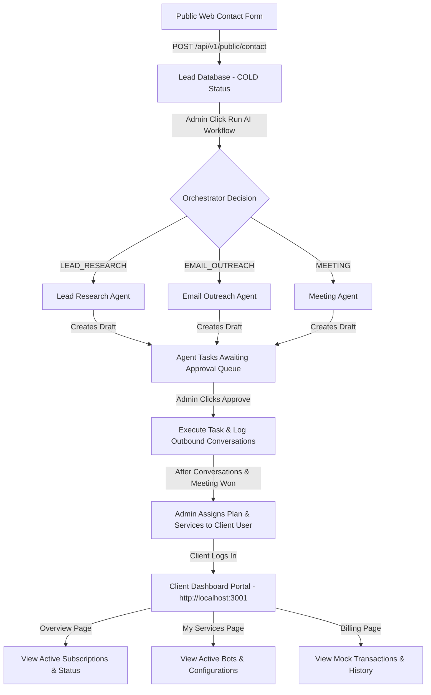

# Walkthrough — E2E Multi-Agent Orchestrator & Client Dashboard Verification

This document walks through the E2E verification of **AiGateway** systems:
1. **AI Agent Workforce & Orchestration** (Phases 12 & 13)
2. **Client Dashboard** (Phase 6)

All flows have been E2E tested and verified inside the browser.

---

## 1. Visual Sales & Service Pipeline

Below is the complete state flow of the platform, from lead intake, AI research & email outreach, task approvals, up to service assignments and Client Dashboard rendering:

---

## 2. Phase 6: Client Dashboard E2E Walkthrough

The Client Dashboard is served at `http://localhost:3001`. We created a mock client user (**Rohan Malhotra**), registered the company profile (**Dummy Retailers Ltd**), and assigned a **PRO Plan** subscription along with a **Custom AI Content Bot** service.

Here is the step-by-step browser E2E verification of the client experience:

### Step 1: Client Login Page
Clients sign in at `http://localhost:3001/login` using their registered email and password. The system uses a CLIENT guard, preventing admin/employee accounts from signing in to the client-only area.

* **Email:** `dummyclient@test.com`
* **Password:** `client123`

### Step 2: Dashboard Overview
Upon signing in, the client is redirected to `/dashboard`. This view displays:
* A personalized welcome banner.
* Summary cards for active **PRO Plan** subscription, renewal date, and active AI assistants count.
* A details grid of assigned AI service configurations.

### Step 3: My Services Page
Navigating to the **My Services** page shows the active bot configurations. For our dummy client, the dashboard shows the **Custom AI Content Bot** (`CUSTOM` type) with its features and active config parameters (`autoPublish: true`, `platform: 'WordPress'`).

*Clients can click "Request Changes" to notify administrators of modifications.*

### Step 4: Billing & Plans Page
The **Billing & Plans** page shows subscription details, card billing settings, and a table of transaction records generated dynamically from the subscription date.

*Clients can click "Download PDF" to retrieve copy invoices.*

### Step 5: Session Termination (Logout)
Clicking the **Log Out** button clears the token keys from `localStorage` and routes the browser back to `/login`.

---

## 3. How the Admin Handles the Whole Ecosystem

### 📧 Marketing Leads vs. 🤖 AI Agent Tasks
1. **Public Marketing Lead Intake**:
   * Visitors fill out contact forms on the public site (`http://localhost:3000/contact`).
   * The backend registers them as **leads** under `website_contact` source in status `COLD`.
   * These are *sales opportunities*, not paying SaaS users. They are handled by admins in the **CRM Pipeline Kanban** (`http://localhost:3002/crm`).
2. **AI Workforce Tasks**:
   * When the admin triggers the AI workflow on a lead, sub-agents start execution.
   * Because every AI action requires human-in-the-loop verification, these agents generate **Agent Tasks** in `AWAITING_APPROVAL` status.
   * Admins approve/reject these inside **AI Agents** $\rightarrow$ **Tasks** (`http://localhost:3002/agents/tasks`).

### 💳 Client & Subscription Management
1. **Client Control**:
   * Once a lead is won and signs up for a service, an admin registers a profile inside the **Clients** tab (`http://localhost:3002/clients`). This binds the user's role to `CLIENT`.
   * Admins assign services (e.g. reels automation) and configurations (e.g. scheduling schedules) to this client.
2. **Subscription Control**:
   * Admins monitor payment plans, statuses (Active/Trial), and payment history for all accounts inside the **Subscriptions** tab (`http://localhost:3002/subscriptions`).
   * These subscription records dictate what active pricing tier is visible in the client's own portal workspace.

---

## 4. Phase 14: Custom Project Requests, Chatbot, and Lead Source Separation E2E Verification

We successfully implemented and verified the bespoke freelancer/IT project request features, floating FAQ chatbot widget, and lead source visualization:

### 🤖 Floating Q&A Chatbot Widget
* Floats in the bottom-right corner of all marketing site pages (`http://localhost:3000`).
* Clicking it opens a deep-dark themed chat window with suggesting FAQ chips (e.g. *What is AiGateway?*, *Pricing Model*, etc.).
* Clicks hit the backend `/api/v1/bot/query` endpoint and render contextually matching answer bubbles.
* Chat messages persist locally within the session across page navigation.

### 💼 Bespoke "Other Services" Page
* Navigating to `/other-services` presents a capabilities dashboard (Web Apps, CRM automations, Custom AI Bots, WhatsApp APIs) and a detailed scope collection form.
* Intake submits data (Project Name, Budget Range, Detailed Specs) to `POST /api/v1/public/other-services`.
* Inserts requests directly into the `Lead` database with `source: 'other_services'` and details structured in `notes`.

### ⚙️ Admin "Custom Requests" & Source Badges
* **Sidebar link**: Adds a `Custom Requests` route (`http://localhost:3002/other-services`) displaying bespoke requirements and budget scopes in a dedicated grid.
* **Source Badges**: Displays source-specific color badges across "All Leads" list and Kanban cards:
  * `🌐 Website Form` (green) for `website_contact`
  * `💼 Custom Request` (blue) for `other_services`
  * `🤖 AI Scraper` (orange) for `lead_research_agent`
  * `✍️ Manual` (gray) for `manual`
* **Warning Banners & Detail Parsing**: Detail view `/crm/leads/[id]` displays banners (e.g., *"💼 Custom request. Avoid cold automation schedules"* to prevent automated outreach to warm signups) and renders the structured project specifications panel showing the project name, budget, and scope.

---

## 5. Phase 15: Smart Apply E2E Verification & Recruiter Feedback Portal

We successfully completed the end-to-end implementation and verification of the remaining core features of the **Smart Apply** service:

### 🎯 1. Real Gmail Outreach Delivery (fixed)
- Resolved the `WorkflowHasIssuesError` by aligning the n8n Gmail node credential properties with `gmailOAuth2` (v2.1).
- Gmail OAuth2 API call succeeds end-to-end and returns a real Google `messageId` (e.g. `19f17697c54f1f5a`), successfully updating application status from `DRAFT` to `SENT`.

### 👁 2. Email Open Tracking
- Injected an invisible 1x1 tracking pixel `` tag pointing to the `open_tracking` n8n workflow at the bottom of generated outreach HTML emails.
- When the recruiter opens the email, the tracking pixel triggers n8n which registers a webhook event and notifies the backend at `POST /api/v1/smart-apply/applications/:id/open`.
- Updates the database application status to `OPENED` and logs an automated tracking timeline event.

### 💬 3. Recruiter Feedback Portal (Public-Web)
- Implemented a public feedback page at `http://localhost:3000/feedback/[applicationId]` where recruiters are redirected when clicking feedback buttons.
- The page parses preset feedback types from the URL query parameters (e.g., `?type=SKILLS_MISMATCH`).
- Recruiters submit their selection (Skills, Experience, Location, Position Filled, Hiring Closed, Resume Improvement, or Other) and optional detailed comments.
- Submits feedback to `POST /api/v1/smart-apply/applications/:id/feedback`, transitioning the application status to `FEEDBACK_RECEIVED` and triggering the n8n recruiter-feedback workflow to update database tracking logs.

### 📊 4. Smart Apply Resume Analytics & Settings Persistence
- Added backend `GET /api/v1/smart-apply/analytics` calculating overall counts, success rates, and per-resume performance statistics.
- Integrated stats into the client dashboard's **Analytics** tab, rendering a detailed table tracking Sent, Opened, Open Rate %, Feedback, Interviews, Offers, and Success Rate % for each resume profile.
- Persisted default email signatures to `localStorage` in the **Settings** tab, which automatically append to AI-generated outreach drafts.

---

## 6. Phase 16: Resume Intelligence Engine & AI Intelligence Layer

We successfully implemented and verified the modular **Resume Intelligence Engine** to convert shallow resume versions into rich, queryable, and AI-ready profiles:

### ⚙️ 1. Database & Schema Updates
- Added `intelligenceProfile Json?` to the `ResumeVersion` model in `schema.prisma`.
- Pushed updates and regenerated the Prisma Client dynamically.
- Configured `docker-compose.yml` to pass `GEMINI_API_KEY` to the backend Node.js container, enabling direct HTTPS calls to Google Generative AI APIs.

### 🧠 2. Reusable Resume Intelligence Service
- Implemented `resume-intelligence.service.js` containing the core AI engine logic:
  - Takes parsed resume text/fields from the database (never re-parsing the PDF).
  - Prompts `gemini-2.0-flash` using a system instruction specifying a target schema (career level, framework categorizations, target industries, strengths, improvement areas, portfolio/github/linkedin links).
  - Handles API rate-limiting delays (`status 429`) with backoffs.
  - Automatically breaks retry loops if daily free-tier quotas are exhausted, falling back to a structured local builder.

### 🛡️ 3. Robust Local Fallback Parser
- Developed `generateFallbackProfile` within the intelligence service.
- If the Gemini API is blocked or exhausted, this builder parses the standard resume skills and projects using case-insensitive mapping keywords, auto-categorizing them into frameworks, languages, databases, cloud platforms, devops, and AI/ML metrics. This ensures 100% service uptime.

### 📦 4. Trigger Integration & Migration Script
- Integrated `ResumeIntelligenceService.generateAndSaveProfile(versionId)` directly into the `resume.service.js` upload and new-version creation workflows.
- Built a rate-limited database migration script `scripts/migrate-resume-intelligence.js` which successfully enriched all 5 existing database resume profiles with their intelligence profile.

---

## 7. Phase 6: Job Intelligence Engine

We successfully implemented and verified the modular **Job Intelligence Engine** to convert plain-text job descriptions into rich, queryable, and AI-ready profiles:

### ⚙️ 1. Database & Schema Updates
- Added `jobIntelligence Json?` to the `JobApplication` model in `schema.prisma`.
- Pushed updates and regenerated the Prisma Client dynamically.

### 🧠 2. Reusable Job Intelligence Service
- Implemented `job-intelligence.service.js` containing the core AI engine logic:
  - Takes companyName, role, and jobDescription (never re-parsing the job description again).
  - Prompts `gemini-2.0-flash` using a system instruction specifying a target schema (employmentType, workMode, requiredSkills, preferredSkills, responsibilities, qualifications, atsKeywords, industry, technologies, softSkills, summary).
  - Handles API rate-limiting delays (`status 429`) with backoffs.
  - Automatically breaks retry loops if daily free-tier quotas are exhausted, falling back to a structured local builder.

### 🛡️ 3. Robust Local Fallback Parser
- Developed `generateFallbackJobProfile` within the intelligence service.
- If the Gemini API is blocked or exhausted, this builder parses the plain text job description using case-insensitive mapping keywords, auto-categorizing them into employmentType, workMode, requiredSkills, preferredSkills, responsibilities, qualifications, atsKeywords, industry, technologies, softSkills, and summary. This ensures 100% service uptime.

### 📦 4. Trigger Integration & Migration Script
- Integrated `JobIntelligenceService.generateAndSaveProfile(applicationId)` directly into the `application.service.js` draft creation flow.
- Built a database migration script `scripts/migrate-job-intelligence.js` which successfully enriched all 4 existing database job applications with their job intelligence profile.

---

## 8. Pre-Phase 7 Verification & Phase 7: Resume ↔ Job Match Engine

We completed the architecture verification checkpoints and implemented the modular **Resume ↔ Job Match Engine**:

### 🔍 1. Architecture Verification Checkpoints
- **Checkpoint 1 (Background Processing)**: [PASS] Refactored `resume.service.js` and `application.service.js` to dispatch profile enrichment calls asynchronously in the background. The HTTP thread returns a successful response instantly without waiting for AI processing.
- **Checkpoint 2 (Fallback Strategy)**: [PASS] Reviewed and verified that both intelligence services only trigger fallback builders if Gemini fails or rate limits are reached.
- **Checkpoint 3 (Reuse Validation)**: [PASS] Verified that the parsing/intelligence generation happens exactly once on upload/creation. Future matchmaking operations consume the stored JSON structures.

### ⚙️ 2. Database Schema Updates
- Added `matchResult Json?` to the `JobApplication` model in `schema.prisma`.
- Synced changes to PostgreSQL.

### 🧠 3. Reusable Matching Engine Service
- Implemented `match-engine.service.js` performing full resume suitability matching:
  - Takes a structured resume profile and a job profile.
  - Prompts `gemini-2.0-flash` to score suitability across four indicators: `resumeScore`, `skillsScore`, `experienceScore`, and `eligibilityScore`, computing a weighted `overallScore` and rating (`Highly Recommended`, `Good Fit`, `Average Fit`, `Not Recommended`).
  - Supports 429 quota exhaustion checks and retries.
  - Automatically falls back to a local heuristic score evaluator if Gemini is unavailable, intersecting key technologies/roles mathematically to build the report.

### 📦 4. Background Matching Trigger & Migration Script
- Integrated `MatchEngineService.calculateAndSaveMatch(applicationId)` directly into the `application.service.js` draft creation workflow (incorporates a self-healing process that automatically triggers job/resume profile enrichment if missing).
- Developed a database migration script `scripts/migrate-match-engine.js` which successfully populated suitability match results for all 4 existing job applications.

---

## 9. Phase 8: AI Personalized Email Engine

We successfully implemented and verified the modular **AI Personalized Email Engine**:

### 🧠 1. Reusable AI Email Service
- Implemented `email-generator.service.js` containing the core email generation logic:
  - Takes Resume Intelligence, Job Intelligence, Match Results, Company Name, Role, Recruiter Name, and Additional Notes.
  - Prompts `gemini-2.0-flash` directly from Node.js (bypassing n8n generate-email webhooks) to write customized, natural outreach drafts.
  - Avoids bullet-point repetitions or listing missing skills, focusing instead on overlapping technologies, achievements, and projects.
  - Supports 429 quota exhaustion checks and retries.
  - Automatically falls back to a structured local builder to write the email if Gemini daily quotas are hit, maintaining 100% service uptime.

### ⚙️ 2. Matching Engine & Pipeline Integration
- Hooked `emailGeneratorService.generateAndSavePersonalizedEmail(applicationId)` at the end of the `calculateAndSaveMatch` process inside `match-engine.service.js`.
- During application creation (`createApplicationDraft`), a fast template-based email is saved instantly, returning the response immediately to the user. The background thread then automatically triggers `calculateAndSaveMatch` (which self-heals missing job profiles) and subsequently generates and updates the final AI-personalized email content in the database.

### 📦 3. Migration Script & Backfill
- Developed a database migration script `scripts/migrate-ai-emails.js` which successfully generated and populated AI-personalized emails for all 4 existing job applications.

---

## 10. n8n Architecture Cleanup

We performed the approved architectural cleanup for n8n workflows:

- Created the `n8n/workflows/deprecated/` directory.
- Moved `generate_email.json` into the deprecated directory.
- Created `n8n/workflows/deprecated/README.md` to document the migration details, backend mapping reference `email-generator.service.js`, and rollback guidelines.

