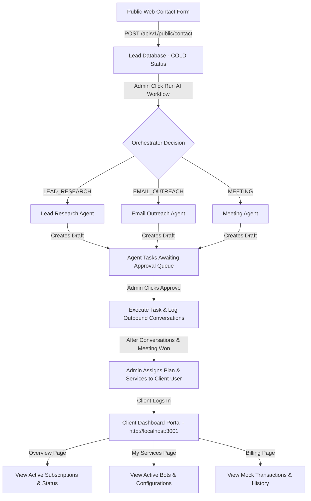
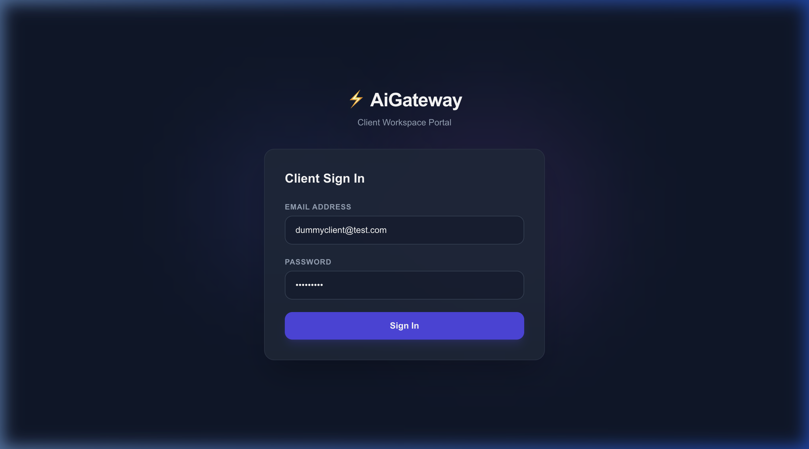
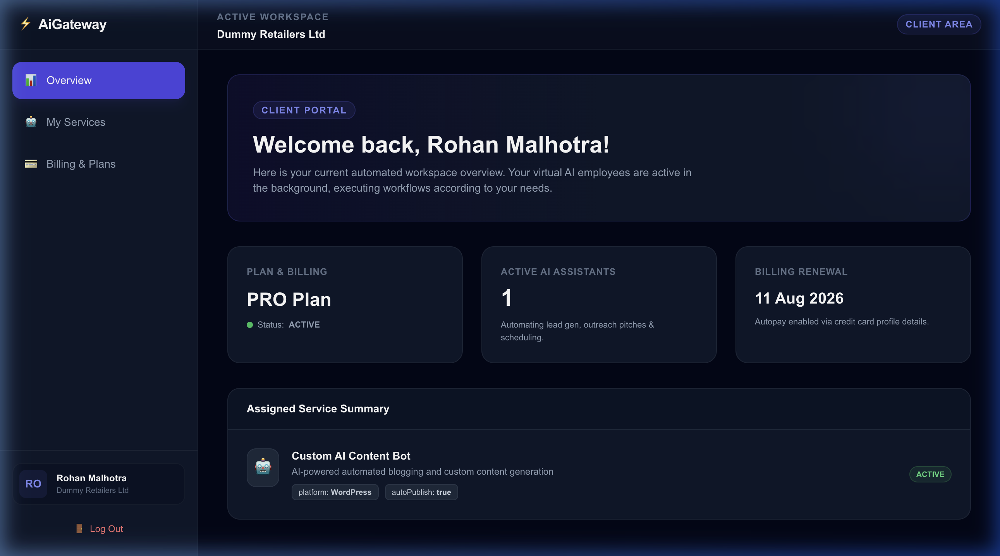
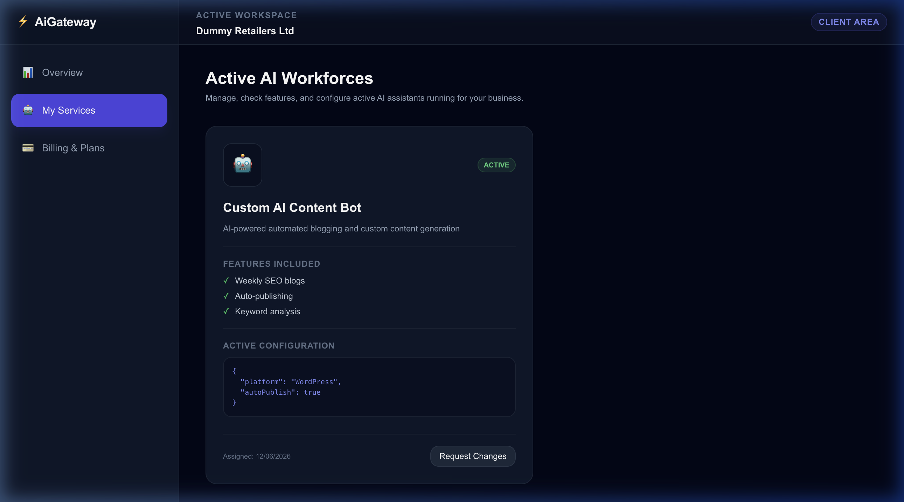
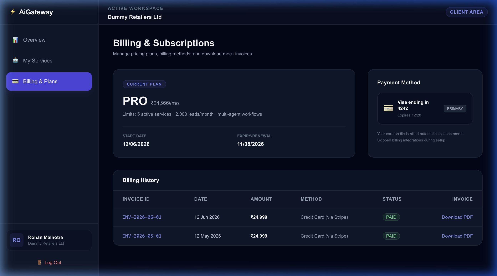

# Walkthrough — E2E Multi-Agent Orchestrator & Client Dashboard Verification

This document walks through the E2E verification of **AiGateway** systems:
1. **AI Agent Workforce & Orchestration** (Phases 12 & 13)
2. **Client Dashboard** (Phase 6)

All flows have been E2E tested and verified inside the browser.

---

## 1. Visual Sales & Service Pipeline

Below is the complete state flow of the platform, from lead intake, AI research & email outreach, task approvals, up to service assignments and Client Dashboard rendering:

---

## 2. Phase 6: Client Dashboard E2E Walkthrough

The Client Dashboard is served at `http://localhost:3001`. We created a mock client user (**Rohan Malhotra**), registered the company profile (**Dummy Retailers Ltd**), and assigned a **PRO Plan** subscription along with a **Custom AI Content Bot** service.

Here is the step-by-step browser E2E verification of the client experience:

### Step 1: Client Login Page
Clients sign in at `http://localhost:3001/login` using their registered email and password. The system uses a CLIENT guard, preventing admin/employee accounts from signing in to the client-only area.

* **Email:** `dummyclient@test.com`
* **Password:** `client123`

### Step 2: Dashboard Overview
Upon signing in, the client is redirected to `/dashboard`. This view displays:
* A personalized welcome banner.
* Summary cards for active **PRO Plan** subscription, renewal date, and active AI assistants count.
* A details grid of assigned AI service configurations.

### Step 3: My Services Page
Navigating to the **My Services** page shows the active bot configurations. For our dummy client, the dashboard shows the **Custom AI Content Bot** (`CUSTOM` type) with its features and active config parameters (`autoPublish: true`, `platform: 'WordPress'`).

*Clients can click "Request Changes" to notify administrators of modifications.*

### Step 4: Billing & Plans Page
The **Billing & Plans** page shows subscription details, card billing settings, and a table of transaction records generated dynamically from the subscription date.

*Clients can click "Download PDF" to retrieve copy invoices.*

### Step 5: Session Termination (Logout)
Clicking the **Log Out** button clears the token keys from `localStorage` and routes the browser back to `/login`.

---

## 3. How the Admin Handles the Whole Ecosystem

### 📧 Marketing Leads vs. 🤖 AI Agent Tasks
1. **Public Marketing Lead Intake**:
   * Visitors fill out contact forms on the public site (`http://localhost:3000/contact`).
   * The backend registers them as **leads** under `website_contact` source in status `COLD`.
   * These are *sales opportunities*, not paying SaaS users. They are handled by admins in the **CRM Pipeline Kanban** (`http://localhost:3002/crm`).
2. **AI Workforce Tasks**:
   * When the admin triggers the AI workflow on a lead, sub-agents start execution.
   * Because every AI action requires human-in-the-loop verification, these agents generate **Agent Tasks** in `AWAITING_APPROVAL` status.
   * Admins approve/reject these inside **AI Agents** $\rightarrow$ **Tasks** (`http://localhost:3002/agents/tasks`).

### 💳 Client & Subscription Management
1. **Client Control**:
   * Once a lead is won and signs up for a service, an admin registers a profile inside the **Clients** tab (`http://localhost:3002/clients`). This binds the user's role to `CLIENT`.
   * Admins assign services (e.g. reels automation) and configurations (e.g. scheduling schedules) to this client.
2. **Subscription Control**:
   * Admins monitor payment plans, statuses (Active/Trial), and payment history for all accounts inside the **Subscriptions** tab (`http://localhost:3002/subscriptions`).
   * These subscription records dictate what active pricing tier is visible in the client's own portal workspace.

---

## 4. Phase 14: Custom Project Requests, Chatbot, and Lead Source Separation E2E Verification

We successfully implemented and verified the bespoke freelancer/IT project request features, floating FAQ chatbot widget, and lead source visualization:

### 🤖 Floating Q&A Chatbot Widget
* Floats in the bottom-right corner of all marketing site pages (`http://localhost:3000`).
* Clicking it opens a deep-dark themed chat window with suggesting FAQ chips (e.g. *What is AiGateway?*, *Pricing Model*, etc.).
* Clicks hit the backend `/api/v1/bot/query` endpoint and render contextually matching answer bubbles.
* Chat messages persist locally within the session across page navigation.

### 💼 Bespoke "Other Services" Page
* Navigating to `/other-services` presents a capabilities dashboard (Web Apps, CRM automations, Custom AI Bots, WhatsApp APIs) and a detailed scope collection form.
* Intake submits data (Project Name, Budget Range, Detailed Specs) to `POST /api/v1/public/other-services`.
* Inserts requests directly into the `Lead` database with `source: 'other_services'` and details structured in `notes`.

### ⚙️ Admin "Custom Requests" & Source Badges
* **Sidebar link**: Adds a `Custom Requests` route (`http://localhost:3002/other-services`) displaying bespoke requirements and budget scopes in a dedicated grid.
* **Source Badges**: Displays source-specific color badges across "All Leads" list and Kanban cards:
  * `🌐 Website Form` (green) for `website_contact`
  * `💼 Custom Request` (blue) for `other_services`
  * `🤖 AI Scraper` (orange) for `lead_research_agent`
  * `✍️ Manual` (gray) for `manual`
* **Warning Banners & Detail Parsing**: Detail view `/crm/leads/[id]` displays banners (e.g., *"💼 Custom request. Avoid cold automation schedules"* to prevent automated outreach to warm signups) and renders the structured project specifications panel showing the project name, budget, and scope.
